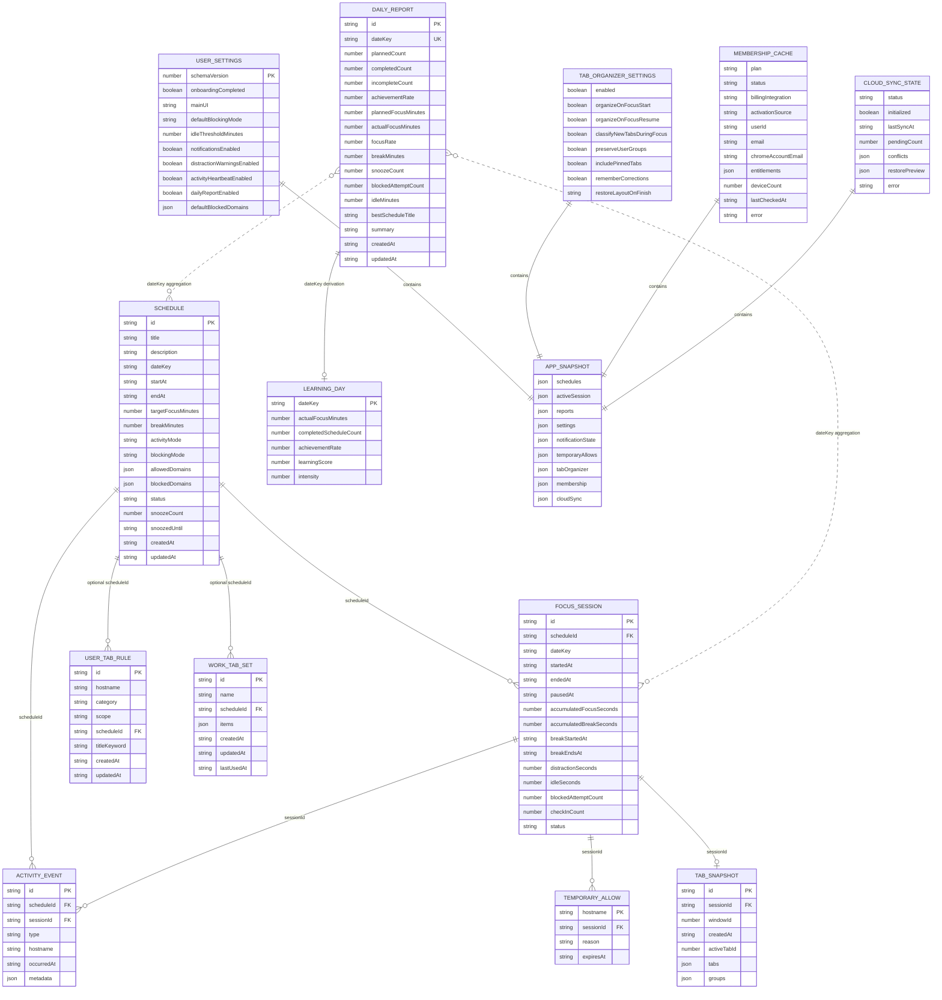

# 미루지마 ERD 및 데이터 사전

> 문서 기준일: 2026-07-16  
> 데이터 계층: `chrome.storage.local` 논리 모델 + Supabase PostgreSQL 물리 모델

## 1. 데이터 구조 개요

미루지마는 두 데이터 계층을 사용한다.

1. **로컬 저장소**: Free와 Premium 모두의 실행 원본이다. Chrome Storage는 관계형 DB가 아니므로 아래 로컬 ERD는 코드상 참조 관계를 표현한 논리 ERD다.
2. **Supabase PostgreSQL**: Premium 인증, entitlement, 기기, 365일 구조화 데이터 동기화, AI rate limit을 관리한다.

로컬 집중 기능은 cloud가 없어도 동작한다. Cloud에는 일정, 설정, 완료 세션, 리포트, 학습 일자만 전송하며 heartbeat, DNR, alarm, 임시 허용, 탭 snapshot, AI 임시 데이터는 전송하지 않는다.

## 2. 로컬 논리 ERD



### 2.1 로컬 저장 키

| Chrome Storage key | 값 | Cloud 동기화 |
|---|---|---|
| `mirujima:schema-version` | 로컬 schema version | 아니오 |
| `mirujima:schedules` | `Schedule[]` | Premium 예 |
| `mirujima:active-session` | 현재 `FocusSession` | 아니오 |
| `mirujima:session-history` | 종료된 `FocusSession[]` | 완료 요약만 예 |
| `mirujima:activity-events` | `ActivityEvent[]` | 아니오 |
| `mirujima:reports` | `DailyReport[]` | Premium 예 |
| `mirujima:settings` | `UserSettings` | Premium 예 |
| `mirujima:notification-state` | 알림 ID별 발송·처리 상태 | 아니오 |
| `mirujima:temporary-allows` | `TemporaryAllow[]` | 아니오 |
| `mirujima:tab-organizer-*` | 탭 설정, 규칙, 세트, snapshot, runtime 요약 | 아니오 |
| `mirujima:membership-cache` | 현재 멤버십 snapshot | 서버에서 재검증 |
| `mirujima:membership-device-id` | client generated device ID | 기기 등록에 사용 |
| `mirujima:cloud-pending-mutations` | 오프라인 변경 queue | 서버 적용 전 로컬 |
| `mirujima:cloud-record-metadata` | entity별 cloud version | sync metadata |
| `mirujima:cloud-sync-state` | 초기화·동기화·충돌 상태 | 제어 상태 |
| `mirujima:cloud-learning-days` | 학습 잔디 cache | Premium 예 |
| `mirujima:cloud-restore-records` | 복원 preview 임시 record | 확인 후 병합 |

### 2.2 로컬 핵심 값 제약

| 모델 | 필드 | 제약 |
|---|---|---|
| Schedule | `activityMode` | `interactive`, `reading`, `watching`, `offline` |
| Schedule | `blockingMode` | `allowlist`, `blocklist`, `off` |
| Schedule | `status` | `scheduled`, `snoozed`, `focusing`, `paused`, `completed`, `cancelled`, `incomplete` |
| FocusSession | `status` | `active`, `paused`, `awaiting-result`, `completed`, `cancelled` |
| ActivityEvent | `type` | heartbeat, blocked-attempt, temporary-allow, idle-start/end, break-start/end, check-in, snooze |
| DomainRule | `hostname` | protocol·path·query·hash·`www.` 제거, 소문자 |
| DomainRule | `includeSubdomains` | hostname 하위 도메인 포함 여부 |
| DailyReport | `dateKey` | 로컬 날짜별 논리 unique |
| LearningDay | `intensity` | 0~4 |
| UserTabRule | `scope` | `global`, `schedule` |
| TabCategory | 값 | `work`, `reference`, `communication`, `break`, `unclassified` |

## 3. Supabase 물리 ERD

물리 ERD의 table, column, PK, FK, CHECK, RLS 기준은 아래 migration을 순서대로 모두 적용한 최종 schema다.

| 적용 순서 | SQL 파일 | schema 영향 |
|---:|---|---|
| 1 | `202607160001_gate_a_membership.sql` | profiles, memberships, entitlements, devices, Premium 활성화 RPC |
| 2 | `202607160002_gate_b_cloud_sync.sql` | 5개 cloud entity, mutation ledger, version 충돌·정리 RPC |
| 3 | `202607160003_gate_c_ai_writing.sql` | AI rate limit과 기본 문법 교정 quota RPC |
| 4 | `202607160004_gate_d_content_summary.sql` | content-summary entitlement, 기존 Premium backfill, task별 복합 quota |

Gate D 적용 후 `ai_rate_limits`의 최종 PK는 단일 `user_id`가 아니라 `(user_id, task)`이며, Premium entitlement는 5개가 아니라 6개다.

```mermaid
erDiagram
  AUTH_USERS ||--|| PROFILES : "id"
  AUTH_USERS ||--|| MEMBERSHIPS : "user_id"
  AUTH_USERS ||--o{ MEMBERSHIP_ENTITLEMENTS : "user_id"
  AUTH_USERS ||--o{ DEVICES : "user_id"
  AUTH_USERS ||--o{ CLOUD_SCHEDULES : "user_id"
  AUTH_USERS ||--o{ CLOUD_SETTINGS : "user_id"
  AUTH_USERS ||--o{ CLOUD_FOCUS_SESSIONS : "user_id"
  AUTH_USERS ||--o{ CLOUD_REPORTS : "user_id"
  AUTH_USERS ||--o{ CLOUD_LEARNING_DAYS : "user_id"
  AUTH_USERS ||--o{ SYNC_MUTATIONS : "user_id"
  AUTH_USERS ||--o{ AI_RATE_LIMITS : "user_id"
  MEMBERSHIPS ||--o{ MEMBERSHIP_ENTITLEMENTS : grants

  AUTH_USERS {
    uuid id PK
  }

  PROFILES {
    uuid id PK
    text display_name
    text avatar_url
    timestamptz created_at
    timestamptz updated_at
  }

  MEMBERSHIPS {
    uuid user_id PK
    text plan
    text billing_integration
    text activation_source
    text status
    timestamptz activated_at
    timestamptz updated_at
  }

  MEMBERSHIP_ENTITLEMENTS {
    uuid user_id PK
    text feature_key PK
    boolean enabled
    text source
    timestamptz valid_until
    timestamptz updated_at
  }

  DEVICES {
    uuid id PK
    uuid user_id FK
    text client_generated_device_id UK
    text device_name
    text extension_version
    timestamptz last_seen_at
    timestamptz created_at
    timestamptz updated_at
  }

  CLOUD_SCHEDULES {
    uuid user_id PK
    text entity_id PK
    jsonb payload
    bigint version
    text device_id
    timestamptz deleted_at
    timestamptz created_at
    timestamptz updated_at
  }

  CLOUD_SETTINGS {
    uuid user_id PK
    text entity_id PK
    jsonb payload
    bigint version
    text device_id
    timestamptz deleted_at
    timestamptz created_at
    timestamptz updated_at
  }

  CLOUD_FOCUS_SESSIONS {
    uuid user_id PK
    text entity_id PK
    jsonb payload
    bigint version
    text device_id
    timestamptz deleted_at
    timestamptz created_at
    timestamptz updated_at
  }

  CLOUD_REPORTS {
    uuid user_id PK
    text entity_id PK
    jsonb payload
    bigint version
    text device_id
    timestamptz deleted_at
    timestamptz created_at
    timestamptz updated_at
  }

  CLOUD_LEARNING_DAYS {
    uuid user_id PK
    date date_key PK
    integer actual_focus_minutes
    integer completed_schedule_count
    integer achievement_rate
    integer learning_score
    smallint intensity
    jsonb payload
    bigint version
    text device_id
    timestamptz deleted_at
    timestamptz created_at
    timestamptz updated_at
  }

  SYNC_MUTATIONS {
    uuid mutation_id PK
    uuid user_id PK
    text entity_type
    text entity_id
    text operation
    bigint expected_version
    text result_status
    jsonb result_record
    text device_id
    timestamptz created_at
  }

  AI_RATE_LIMITS {
    uuid user_id PK
    text task PK
    timestamptz window_started_at
    integer request_count
    timestamptz updated_at
  }
```



## 4. Supabase 테이블 사전

### 4.1 계정과 멤버십

| 테이블 | PK | 역할 | 주요 제약 |
|---|---|---|---|
| `profiles` | `id` | Supabase 사용자 프로필 확장 | `auth.users.id`와 1:1, 사용자 본인 조회·수정 |
| `memberships` | `user_id` | plan과 활성 상태의 서버 원본 | plan=`free/premium`, status=`active/inactive` |
| `membership_entitlements` | `(user_id, feature_key)` | 기능 단위 Premium 권한 | 6개 entitlement, 만료 시각 지원 |
| `devices` | `id` | 계정에 연결된 Chrome 설치 | `(user_id, client_generated_device_id)` unique |

현재 entitlement:

- `learning-grass`
- `cloud-backup`
- `cloud-sync`
- `screen-ocr`
- `grammar-correction`
- `content-summary`

### 4.2 Cloud entity 테이블

`cloud_schedules`, `cloud_settings`, `cloud_focus_sessions`, `cloud_reports`는 같은 versioned record 구조를 사용한다.

| 필드 | 의미 |
|---|---|
| `user_id` | 소유 사용자 |
| `entity_id` | 클라이언트 stable ID. 설정은 고정 ID 사용 가능 |
| `payload` | 원본 구조화 JSON |
| `version` | 서버 레코드 버전, 1 이상 |
| `device_id` | 마지막 변경 기기 |
| `deleted_at` | 삭제 tombstone. null이면 활성 |
| `created_at`, `updated_at` | 서버 시각 |

`cloud_learning_days`는 검색·집계를 위해 날짜와 핵심 지표를 별도 column으로 보관하고 전체 값도 `payload`에 유지한다.

### 4.3 Mutation과 충돌

`sync_mutations`는 `(user_id, mutation_id)`를 기본키로 사용한다.

1. 클라이언트가 entity, operation, expected version, payload, device ID를 전송한다.
2. 서버가 동일 논리 record에 advisory lock을 건다.
3. 같은 mutation ID가 있으면 이전 결과를 반환한다.
4. 현재 version과 expected version이 다르면 `conflict` 결과와 현재 cloud record를 반환한다.
5. 같으면 version을 1 증가시키고 upsert 또는 tombstone을 적용한다.

허용 entity type은 `schedule`, `settings`, `focus-session`, `report`, `learning-day`이고 operation은 `upsert`, `delete`다.

### 4.4 AI rate limit

`ai_rate_limits`는 `(user_id, task)`별 1분 window를 관리한다.

| task | 분당 한도 |
|---|---:|
| `ocr` | 12 |
| `grammar-correction` | 12 |
| `content-summary` | 6 |
| `study-organize` | 6 |

AI 요청 내용과 결과를 이 테이블에 저장하지 않는다.

## 5. RLS와 접근 규칙

- 모든 public 업무 테이블은 RLS를 사용한다.
- `anon`은 업무 테이블에 접근할 수 없다.
- 인증 사용자는 profiles, membership, entitlement, devices, cloud record 중 자신의 user ID 행만 조회한다.
- device 쓰기는 본인 행에만 허용한다.
- cloud entity 변경은 직접 table write가 아니라 `apply_cloud_mutation`을 사용한다.
- deferred Premium 활성화 RPC는 `service_role`만 실행한다.
- AI rate limit row는 클라이언트가 직접 읽거나 수정하지 않고 security definer 함수로 소비한다.

## 6. 파생 데이터 규칙

### 6.1 일일 리포트

```text
achievementRate = plannedCount == 0
  ? 0
  : round(completedCount / plannedCount * 100)

focusRate = plannedFocusMinutes == 0
  ? 0
  : min(100, round(actualFocusMinutes / plannedFocusMinutes * 100))
```

### 6.2 학습 일자

```text
learningScore = actualFocusMinutes + completedScheduleCount * 10
```

| 점수 | intensity |
|---:|---:|
| 0 | 0 |
| 1~29 | 1 |
| 30~59 | 2 |
| 60~119 | 3 |
| 120 이상 | 4 |

### 6.3 보관

- `ActivityEvent`: 로컬 기본 30일 후 prune
- cloud focus sessions, reports, learning days, sync mutations: 최대 365일 정책
- 삭제된 cloud schedules: tombstone 후 최대 365일 정책
- AI 이미지·OCR·결과: 기본 영구 저장 없음

## 7. 데이터 무결성 주의사항

- Chrome Storage에는 FK가 없으므로 일정 삭제, 세션 종료, snapshot 정리는 repository와 Background에서 일관되게 수행해야 한다.
- `activeSession.scheduleId`에 대응하는 일정이 없으면 bootstrap에서 복구 또는 안전 종료해야 한다.
- DNR rule과 alarm은 데이터가 아니라 파생 runtime 상태이므로 storage snapshot을 기준으로 재생성한다.
- 로컬 `updatedAt`만으로 여러 기기 최신 여부를 결정하지 않고 cloud `version`을 사용한다.
- 동일 `dateKey` 리포트와 학습 일자는 idempotent하게 upsert한다.
- 현재 Gate A migration의 entitlement 제약은 Gate D migration에서 `content-summary`를 추가하므로 배포 순서를 유지해야 한다.

## 8. SQL 검증 명세

저장소의 pgTAP SQL은 ERD의 다음 사항을 검증한다. 이 테스트는 Supabase/PostgreSQL 테스트 환경에서 migration 적용 후 실행해야 한다.

| 테스트 파일 | 검증 범위 |
|---|---|
| `gate_a_membership_rls.test.sql` | Gate A 4개 table, RLS, 8개 ownership policy, activation RPC 권한, 다른 사용자 격리 |
| `gate_b_cloud_sync.test.sql` | Cloud 6개 table, RLS, anon mutation 금지, 최초 version 1, mutation 멱등성, stale version 충돌, 사용자 격리 |
| `gate_c_ai_writing.test.sql` | AI quota table·RLS, counter 비공개, anon 실행 금지, 문법 교정 분당 12회 한도 |
| `gate_d_content_summary.test.sql` | `(user_id, task)` 복합 PK, task quota RPC, 기존 Premium backfill, 6개 entitlement, 요약 6회 한도와 task별 독립 quota |

SQL 테스트가 확인하는 최종 보안 경계:

- `anon`은 membership 활성화, cloud mutation, AI quota 소비를 실행할 수 없다.
- 일반 `authenticated` 사용자는 privileged membership 활성화 RPC를 직접 실행할 수 없다.
- `service_role`만 deferred Premium 활성화 RPC를 실행한다.
- Cloud 쓰기는 `apply_cloud_mutation`을 통해 version과 entitlement를 검사한다.
- 인증 사용자는 RLS에 의해 다른 사용자의 membership, entitlement, device, cloud record를 조회할 수 없다.
