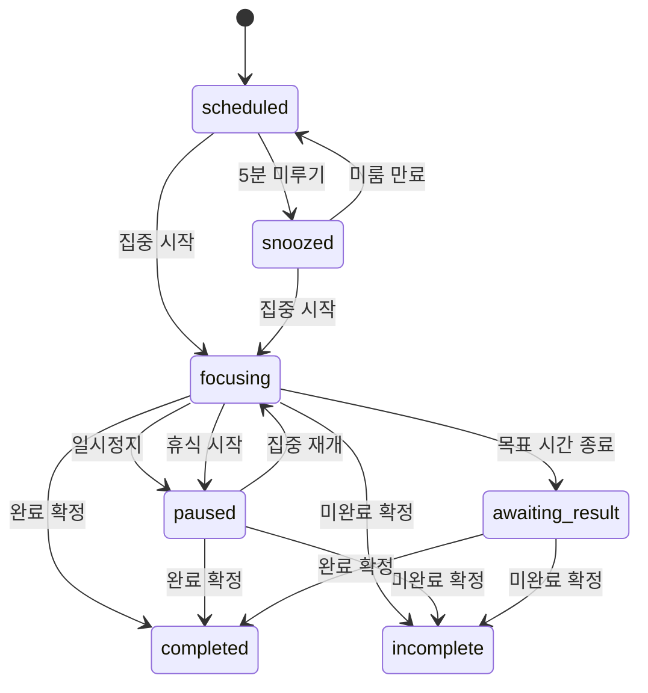

# 미루지마 통합 기능 명세서

> 문서 기준일: 2026-07-16  
> 대상 버전: Mirujima `0.1.0`, Chrome 116+, Manifest V3  
> 기준 자료: `AGENTS.md`, 현재 소스 코드, `docs/` 추가 기능 명세, Supabase migration

## 1. 문서 목적과 상태 기준

이 문서는 미루지마의 Free 집중 기능, 스마트 탭 그룹화, Premium 멤버십, 학습 잔디, 클라우드 동기화, 화면 OCR·AI 도구를 하나의 제품 범위로 통합한 기능 명세서다.

상태 표기는 다음과 같다.

| 상태 | 의미 |
|---|---|
| 구현 | 저장소 코드와 UI가 구현되어 있음 |
| 외부 검증 필요 | 로컬 구현은 있으나 Supabase 배포, OAuth, Groq 또는 Chrome 실환경 검증이 필요함 |
| 보류 | 현재 제품 범위에서 제공하지 않음 |

## 2. 제품 개요

미루지마는 사용자가 일정과 사용할 사이트를 먼저 정한 뒤 실제 집중 행동을 시작하도록 돕는 Chrome 확장 프로그램이다. 집중 중에는 사이트 차단, 활동·자리 비움 확인, 알림, 휴식 기록, 탭 정리를 제공하며 종료 후 일일 리포트를 생성한다. Free 핵심 기능은 로컬 우선으로 동작하고, Premium 사용자는 계정 기반 365일 기록 동기화와 화면 OCR·AI 도구를 사용할 수 있다.

### 2.1 핵심 가치

- 계획을 일정, 알림, 타이머라는 실행 가능한 행동으로 바꾼다.
- 사용자가 선택한 차단 정책을 Chrome 요청 단계에서 적용한다.
- 자리 비움과 방해 신호를 최소 데이터로 판단한다.
- 집중 시간뿐 아니라 휴식, 미루기, 차단 시도, 완료 결과를 함께 기록한다.
- 탭을 닫지 않고 현재 작업 맥락에 맞게 정리한다.
- Free 기능은 로그인이나 외부 서버 없이 유지한다.
- Premium 데이터와 AI 전송은 사용자 선택과 동의 이후에만 수행한다.

### 2.2 사용자 유형

| 사용자 | 사용 범위 |
|---|---|
| Free 사용자 | 일정, 집중, 차단, 알림, 리포트, 탭 그룹화, 로컬 저장 |
| Premium 사용자 | Free 전체 + 학습 잔디 + 클라우드 동기화 + 화면 OCR·AI 교정·요약 |
| 미로그인 사용자 | Free 기능을 로컬에서 사용 |
| 외부 운영자 | Supabase migration, Edge Function, OAuth, Groq secret을 배포·관리 |

## 3. 제품 범위

### 3.1 구현 범위

- 8단계 온보딩
- Side Panel, Popup, 전체 확장 페이지, 차단 페이지
- 일정 CRUD와 겹침·과거 시간·도메인 검증
- 집중 시작, 일시정지, 재개, 누적 휴식, 완료·미완료 종료
- Allowlist, Blocklist, Off 차단
- 임시 허용과 사유 기록
- 일정·집중·자리 비움·방해·종료 알림
- 일일 리포트와 Premium 학습 잔디
- 스마트 탭 분류·그룹화·복원·분류 교정
- Free/Premium 선택, Google OAuth, 서버 entitlement 확인
- 초기 백업·복원, 오프라인 변경 대기열, 충돌 해결, 365일 동기화
- 화면 영역 선택, OCR, 문법 교정·윤문, 핵심 요약, 학습 정리
- JSON 내보내기, 전체 초기화, 도움말, 개인정보 안내

### 3.2 보류 범위

- Stripe Checkout, 실제 결제, 구독 갱신, Customer Portal
- AI 결과의 장기 저장과 동기화 UI
- 웹 하이라이트, 노트, 가이드북
- 전체 페이지 자동 스크롤 캡처
- 모든 서드파티 편집기에 AI 결과 직접 적용
- Chrome 밖 앱, 다른 브라우저, 다른 기기의 실시간 활동 감시

## 4. 공통 제품 규칙

### 4.1 로컬 우선

- 일정, 활성 세션, 최소 활동 이벤트, 알림 상태, 임시 허용, 탭 snapshot은 `chrome.storage.local`에 저장한다.
- Service Worker 전역 변수나 장기 `setTimeout`을 영속 상태로 사용하지 않는다.
- UI는 저장소를 직접 수정하지 않고 공용 메시지를 Background에 전송한다.
- Background가 상태 전환, alarm, DNR, badge, repository 쓰기의 최종 책임을 가진다.
- 외부 서비스 실패가 Free 집중 타이머와 차단을 중단시키지 않는다.

### 4.2 개인정보 최소화

- 일반 집중 기능은 URL 전체 대신 정규화한 hostname만 사용한다.
- 페이지 본문, 검색어, query, hash, 입력값, 실제 키 값은 자동 수집하지 않는다.
- heartbeat는 활동 발생 시각과 visibility만 최대 1분 단위로 전송한다.
- AI는 사용자가 직접 선택한 화면 영역만 preview·동의 후 전송한다.
- OCR 이미지, 원문, 결과는 기본 저장하지 않는다.
- Chrome 밖 앱의 사용 내용은 감지하거나 저장하지 않는다.

### 4.3 시간과 상태

- 시각은 ISO 8601, 날짜 키는 사용자 로컬 기준 `YYYY-MM-DD`로 저장한다.
- 타이머는 시작 시각과 누적 초를 기준으로 계산하며 매초 저장하지 않는다.
- alarm 지연 때문에 실제 집중 시간이 목표 시간을 초과해 기록되지 않아야 한다.
- 저장소 migration과 재시작 복구는 반복 실행해도 결과가 같은 idempotent 동작이어야 한다.

## 5. 기능 요구사항

### 5.1 온보딩 `ONB`

| ID | 요구사항 | 상태 |
|---|---|---|
| ONB-01 | 소개 → 멤버십 → 주 화면 → 알림 → 차단 방식 → 유휴 기준 → 첫 일정 → 완료의 8단계를 제공한다. | 구현 |
| ONB-02 | 모든 단계에서 건너뛰기를 제공하고 건너뛰면 Free, Side Panel 기본값을 사용한다. | 구현 |
| ONB-03 | Premium을 선택하기 전에는 로그인 창이나 외부 요청을 시작하지 않는다. | 구현 |
| ONB-04 | Side Panel과 Popup 중 주 UI를 저장하고 설정에서 변경할 수 있다. | 구현 |
| ONB-05 | 테스트 알림은 클릭할 때마다 고유 ID로 새 알림 생성을 시도한다. | 구현 |
| ONB-06 | 첫 일정은 생략할 수 있고, 생성 시 일반 일정 검증을 동일하게 적용한다. | 구현 |

### 5.2 일정 관리 `SCH`

| ID | 요구사항 | 상태 |
|---|---|---|
| SCH-01 | 일정명, 설명, 날짜, 시작, 목표 집중 시간, 권장 휴식, 활동 유형, 차단 모드, 도메인을 입력한다. | 구현 |
| SCH-02 | 목표 시간을 처음 입력하면 시작 시각을 현재의 약 5분 뒤로 잡고 종료 시각을 자동 계산한다. | 구현 |
| SCH-03 | 종료 시각은 `시작 + 목표 집중 시간`이며 읽기 전용으로 표시한다. | 구현 |
| SCH-04 | 목표 집중 시간과 권장 휴식은 빈 값으로 시작하고 빈 값 또는 0으로 저장할 수 없다. | 구현 |
| SCH-05 | 같은 날짜의 겹치는 일정, 과거 시작 시각, 잘못된 도메인을 폼 내부 오류로 표시한다. | 구현 |
| SCH-06 | 진행 중인 일정은 삭제할 수 없다. 삭제 전 확인을 받는다. | 구현 |
| SCH-07 | 예정·미룸 상태 일정은 Today, Plan, Popup에서 집중을 시작할 수 있다. | 구현 |
| SCH-08 | 5분 미루기 횟수와 시각을 저장하고 3회 이상이면 강화된 경고 대상이 된다. | 구현 |
| SCH-09 | Allowlist와 Blocklist 입력값은 모드 전환 시 삭제하지 않는다. | 구현 |
| SCH-10 | 자주 쓰는 허용·방해 사이트는 클릭형 preset으로 추가·제거할 수 있다. | 구현 |

### 5.3 집중 세션과 휴식 `FOC`

| ID | 요구사항 | 상태 |
|---|---|---|
| FOC-01 | 한 번에 하나의 활성 집중 세션만 허용한다. | 구현 |
| FOC-02 | 시작 시 세션 저장, 종료·상태 확인 alarm, DNR 규칙, badge, 선택적 탭 정리를 설정한다. | 구현 |
| FOC-03 | 일시정지와 휴식 중에는 집중 누적과 사이트 차단을 멈춘다. | 구현 |
| FOC-04 | 재개 시 남은 집중 시간을 기준으로 alarm과 차단을 복구한다. | 구현 |
| FOC-05 | 휴식은 강제 종료 카운트다운이 아니라 일정 단위 누적 시간으로 측정한다. | 구현 |
| FOC-06 | 권장 휴식 전에는 잔여 시간, 초과 후에는 `+시간`을 계속 표시한다. | 구현 |
| FOC-07 | 휴식 종료 alarm은 재개를 권하지만 휴식을 자동 종료하지 않는다. | 구현 |
| FOC-08 | 목표 시간 종료 시 `awaiting-result`로 전환하고 누적·차단·focus-check를 정지한다. | 구현 |
| FOC-09 | 완료·미완료 결과는 Focus, Today, Popup에서 한 번 더 확인한 뒤 저장한다. | 구현 |
| FOC-10 | 종료 알림의 결과 버튼은 `확정/돌아가기` 후속 알림을 거친다. | 구현 |
| FOC-11 | 완료 세션은 session history와 일일 리포트의 집계 원천이 된다. | 구현 |

집중 상태 전이:



### 5.4 사이트 차단과 임시 허용 `BLK`

| ID | 요구사항 | 상태 |
|---|---|---|
| BLK-01 | Allowlist는 등록 hostname과 포함 대상 서브도메인만 허용한다. | 구현 |
| BLK-02 | Blocklist는 등록 hostname과 포함 대상 서브도메인만 차단한다. | 구현 |
| BLK-03 | Off는 차단 없이 타이머와 기록만 제공한다. | 구현 |
| BLK-04 | 집중 중 DNR session rule로 main-frame 요청을 `blocked.html`로 리디렉션한다. | 구현 |
| BLK-05 | 확장 페이지, 제한된 Chrome 내부 URL, 유효한 임시 허용은 차단 대상에서 제외한다. | 구현 |
| BLK-06 | 입력 도메인은 protocol, path, query, hash, `www.`를 제거하고 소문자로 정규화한다. | 구현 |
| BLK-07 | 차단 페이지는 일정명, hostname, 이유, 남은 시간, 허용 목록, 복귀, 임시 허용을 제공한다. | 구현 |
| BLK-08 | 임시 허용은 1분·5분·이번 세션과 사유를 요구하고 만료 alarm을 등록한다. | 구현 |
| BLK-09 | 차단 이벤트에는 일정·세션·hostname·시각만 기록하고 전체 URL은 저장하지 않는다. | 구현 |

### 5.5 집중 상태 확인 `MON`

| ID | 요구사항 | 상태 |
|---|---|---|
| MON-01 | 활성 집중 중 1분마다 focus-check를 실행한다. | 구현 |
| MON-02 | `chrome.idle`, 활성 탭 hostname, visibility, heartbeat, 차단 시도를 조합한다. | 구현 |
| MON-03 | heartbeat 무활동 기준은 interactive 5분, reading 15분, watching 45분이다. | 구현 |
| MON-04 | offline 활동은 Chrome 입력량을 집중 판단에 사용하지 않는다. | 구현 |
| MON-05 | 최근 5분 내 차단 2회 이상 또는 미허용 활성 탭은 distracted 신호다. | 구현 |
| MON-06 | 설정한 3·5·10분 유휴 또는 화면 잠금은 away 신호다. | 구현 |
| MON-07 | 동일 상태 알림에는 cooldown을 적용한다. | 구현 |

`FocusHealth`는 `healthy`, `needs-check`, `distracted`, `away` 중 하나다.

### 5.6 알림 `NOT`

| ID | 요구사항 | 상태 |
|---|---|---|
| NOT-01 | 일정 시작, 미룸 경고, 상태 확인, 방해, 자리 비움, 휴식 종료, 목표 종료, 다음 일정, 리포트 알림을 지원한다. | 구현 |
| NOT-02 | 시스템 알림, badge, 앱 내부 미처리 알림, 차단 페이지를 다중 채널로 사용한다. | 구현 |
| NOT-03 | 일반 알림 ID는 `kind:entityId` 형태로 안정적으로 만들고 최근 발송 시각을 저장한다. | 구현 |
| NOT-04 | 시스템 알림 실패를 핵심 상태 전환 실패로 전파하지 않는다. | 구현 |
| NOT-05 | Today의 미처리 알림은 제목, 본문, 시각, 이동·결과·확인 동작을 제공한다. | 구현 |
| NOT-06 | 본문 클릭은 주 UI를 열되 미처리 항목을 자동 삭제하지 않는다. | 구현 |
| NOT-07 | Popup은 API로 강제 열 수 없으므로 알림 클릭에는 Side Panel 또는 전체 페이지 fallback을 허용한다. | 구현 |

### 5.7 리포트와 학습 잔디 `REP`

| ID | 요구사항 | 상태 |
|---|---|---|
| REP-01 | 날짜별 계획·완료·미완료, 집중, 휴식, 미룸, 차단, 유휴를 집계한다. | 구현 |
| REP-02 | 일정 달성률과 집중 시간 달성률은 0~100 범위로 계산한다. | 구현 |
| REP-03 | 가장 집중한 일정과 규칙 기반 로컬 요약을 제공한다. | 구현 |
| REP-04 | 리포트 생성은 같은 날짜에 반복해도 중복을 만들지 않는다. | 구현 |
| REP-05 | 로컬 이벤트 원본은 기본 30일 보관한다. | 구현 |
| REP-06 | Premium은 Reports 월간 학습 잔디와 Today 연속 학습 일수를 본다. | 구현 |
| REP-07 | 학습 점수는 `집중 분 + 완료 일정 수 × 10`, 강도는 0~4로 계산한다. | 구현 |
| REP-08 | Premium 구조화 리포트·학습 일자는 cloud에서 최대 365일 보관한다. | 외부 검증 필요 |

### 5.8 스마트 탭 그룹화 `TAB`

| ID | 요구사항 | 상태 |
|---|---|---|
| TAB-01 | 현재 활성 일반 창의 탭을 현재 작업, 참고 자료, 커뮤니케이션, 휴식 탭, 분류 필요로 분류한다. | 구현 |
| TAB-02 | 일정 허용 사이트, 저장된 작업 탭 세트, 사용자 교정 규칙을 일반 규칙보다 우선한다. | 구현 |
| TAB-03 | 집중 시작·재개 또는 사용자의 수동 요청에서 정리한다. | 구현 |
| TAB-04 | 고정 탭과 기존 사용자 그룹은 기본적으로 보존한다. | 구현 |
| TAB-05 | 정리 전에 탭·그룹 snapshot을 로컬 저장하고 요청 시 배치를 복원한다. | 구현 |
| TAB-06 | 분류 필요 탭은 이번만, 현재 일정, 전역 범위로 교정할 수 있다. | 구현 |
| TAB-07 | 현재 작업 탭 세트를 일정별 또는 공용으로 저장한다. | 구현 |
| TAB-08 | 탭을 닫거나 새 탭을 강제로 열지 않으며, 그룹화 실패가 집중 시작을 취소하지 않는다. | 구현 |
| TAB-09 | 탭 ID, window ID, group ID, snapshot, runtime metadata는 cloud로 보내지 않는다. | 구현 |

### 5.9 멤버십과 인증 `MEM`

| ID | 요구사항 | 상태 |
|---|---|---|
| MEM-01 | Free 핵심 기능은 로그인 없이 제공한다. | 구현 |
| MEM-02 | Premium 선택 시 Chrome 기본 Google 계정을 확인하고 Supabase PKCE OAuth를 시작한다. | 구현, 외부 검증 필요 |
| MEM-03 | Chrome 계정과 Supabase 계정 불일치를 사용자에게 알린다. | 구현, 외부 검증 필요 |
| MEM-04 | Premium 권한은 클라이언트 선택이 아니라 서버 membership·entitlement로 판정한다. | 구현, 외부 검증 필요 |
| MEM-05 | 현재는 결제 정보 없이 `onboarding_deferred`로 활성화하며 결제 연동 전임을 표시한다. | 구현, 외부 검증 필요 |
| MEM-06 | 같은 Supabase user ID로 다른 PC에서 멤버십을 복구한다. | 구현, 외부 검증 필요 |
| MEM-07 | Premium entitlement는 잔디, 백업, 동기화, OCR, 문법 교정, 핵심 요약이다. | 구현 |
| MEM-08 | Stripe 결제와 실제 구독 상태 연동은 제공하지 않는다. | 보류 |

### 5.10 클라우드 백업과 동기화 `CLD`

| ID | 요구사항 | 상태 |
|---|---|---|
| CLD-01 | 최초 연결 시 이 기기 백업 또는 클라우드 복원 미리보기 중 하나를 명시적으로 선택한다. | 구현, 외부 검증 필요 |
| CLD-02 | 일정, 설정, 완료 세션, 리포트, 학습 일자만 동기화한다. | 구현, 외부 검증 필요 |
| CLD-03 | 로컬 변경을 먼저 저장하고 pending mutation에 추가한다. | 구현 |
| CLD-04 | 15분 alarm과 수동 버튼으로 동기화한다. | 구현, 외부 검증 필요 |
| CLD-05 | mutation ID로 재시도 멱등성을 보장한다. | 구현, 외부 검증 필요 |
| CLD-06 | expected version 불일치는 자동 덮어쓰기하지 않고 사용자에게 로컬·cloud 선택을 요구한다. | 구현, 외부 검증 필요 |
| CLD-07 | 삭제는 tombstone으로 전파한다. | 구현, 외부 검증 필요 |
| CLD-08 | 복원 전 일정·세션·리포트·잔디·삭제 수량을 보여주고 확인 후 병합한다. | 구현, 외부 검증 필요 |
| CLD-09 | heartbeat, 임시 허용, alarm, DNR, 탭 snapshot, AI 임시 이미지는 동기화하지 않는다. | 구현 |

### 5.11 화면 OCR·AI 도구 `AI`

| ID | 요구사항 | 상태 |
|---|---|---|
| AI-01 | Premium `screen-ocr` entitlement가 있을 때만 화면 AI 도구를 연다. | 구현, 외부 검증 필요 |
| AI-02 | 일반 웹페이지의 visible viewport에서 사용자가 drag한 영역만 캡처·crop한다. | 구현, Chrome 검증 필요 |
| AI-03 | 전송 이미지 preview, 민감정보 경고, 명시적 동의를 제공한다. | 구현 |
| AI-04 | Qwen OCR 결과를 stable block ID와 heading·paragraph·list·table·formula 구조로 표시한다. | 구현, Groq 검증 필요 |
| AI-05 | OCR 원문을 사용자가 수정한 뒤 작업을 실행할 수 있다. | 구현 |
| AI-06 | 문법 교정은 맞춤법·문법, 자연스러운 윤문, 간결한 윤문을 제공한다. | 구현, Groq 검증 필요 |
| AI-07 | 교정 결과, diff, 변경 이유, 복사, 지원 입력창 적용을 제공한다. | 구현, Chrome 검증 필요 |
| AI-08 | 핵심 요약은 제목, 핵심 3~5개, 요약, 근거 block, 확인 필요 항목을 제공한다. | 구현, Groq 검증 필요 |
| AI-09 | 학습 정리는 개념·용어·기억할 내용 등을 근거 block과 함께 구조화한다. | 구현, Groq 검증 필요 |
| AI-10 | 결과에서 근거 block으로 이동하고 OCR 원문을 접어서 대조할 수 있다. | 구현 |
| AI-11 | AI 결과는 부정확할 수 있으며 의료·법률·재무 판단의 단독 근거로 쓰지 않도록 안내한다. | 구현 |
| AI-12 | 서버가 entitlement와 task별 분당 rate limit을 검사하고 Groq key를 클라이언트에 노출하지 않는다. | 구현, 외부 검증 필요 |
| AI-13 | 전체 페이지 캡처, Chrome 제한 페이지, 모든 편집기 직접 적용은 보장하지 않는다. | 범위 제한 |

### 5.12 설정·데이터·도움말 `SET`

| ID | 요구사항 | 상태 |
|---|---|---|
| SET-01 | 주 UI, 기본 차단, 유휴 기준, 알림, heartbeat, 일일 리포트를 설정한다. | 구현 |
| SET-02 | 탭 그룹화 실행 시점, 기존 그룹·고정 탭, 교정 기억, 종료 복원 정책을 설정한다. | 구현 |
| SET-03 | 멤버십 상태와 cloud 초기화·동기화·복원·충돌 해결을 설정 화면에서 제공한다. | 구현 |
| SET-04 | JSON 전체 내보내기를 제공하되 가져오기나 표 변환을 제공한다고 표현하지 않는다. | 구현 |
| SET-05 | 전체 초기화는 확인 후 로컬 데이터를 지우고 온보딩 상태로 돌아간다. | 구현 |
| SET-06 | 온보딩 다시 보기와 매 클릭 새 알림 테스트를 제공한다. | 구현 |
| SET-07 | 도움말은 차단 방식, 집중·휴식, 알림 문제 해결, 데이터·개인정보, 설치 제약을 설명한다. | 구현 |

## 6. 화면별 기능 요약

| 화면 | 주요 정보 | 핵심 동작 |
|---|---|---|
| Today | 미처리 알림, 현재·다음 일정, 달성률, 연속 학습, 오늘 일정 | 집중 이동, 시작, 5분 미루기, 알림 처리 |
| Plan | 일정 목록, 상태, 시간, 집중·휴식, 차단 도메인 | 추가, 수정, 삭제, 집중 시작 |
| Focus | 세션 상태, 타이머, 사이트 정책, 집중 신호, 탭 그룹 | 일시정지, 휴식, 재개, 종료, 탭 정리·복원 |
| Reports | 일일 지표, 달성률, 요약, 최고 일정, 월간 잔디 | 오늘 집계, 월 이동 |
| Settings | 멤버십, cloud, 집중·알림, 탭 설정, 데이터 | 로그인, 동기화, 설정 저장, 내보내기, 초기화 |
| Help | 사용법, 개인정보, Chrome 제약 | 문서 펼치기 |
| 화면 AI 도구 | 선택 이미지, OCR block, 교정·요약 결과 | 선택, 동의, 수정, 실행, 복사, 입력창 적용 |
| Popup | 현재·다음 일정, 타이머, 오늘 달성률 | 빠른 집중 제어, Side Panel·전체 화면 열기 |
| 차단 페이지 | 차단 이유, 남은 시간, 허용 사이트 | 돌아가기, 사유 기반 임시 허용 |

## 7. 비기능 요구사항

### 7.1 호환성과 복구

- Chrome 116 이상, Manifest V3를 지원한다.
- Service Worker 종료·재시작, Chrome 재시작 후 storage를 기준으로 alarm·DNR·badge를 복구한다.
- 삭제된 일정 alarm, 세션 없는 DNR, DNR 없는 활성 세션, 중복 alarm·notification을 정리한다.
- 확장 reload 전 열린 탭의 Content Script는 runtime invalidation을 감지하면 heartbeat를 중단한다.

### 7.2 접근성과 반응형

- 색상 외 텍스트·아이콘·상태명을 함께 사용한다.
- 모든 주요 버튼은 접근성 이름과 최소 44px 높이를 가진다.
- Popup은 약 380px 폭, Side Panel은 좁은 폭 1열, 전체 페이지는 700px 이상에서만 확장 grid를 사용한다.
- 긴 일정명과 hostname은 카드 내부에서 줄바꿈한다.
- `prefers-reduced-motion`을 존중한다.

### 7.3 오류 처리

- 폼 validation과 action 오류는 현재 화면과 입력을 보존한다.
- bootstrap·storage·runtime 연결 실패만 전체 치명적 오류 화면으로 전환한다.
- 치명적 오류 화면은 다시 시도와 이전 화면을 제공한다.
- 알림, 탭 그룹화, cloud, AI 실패는 가능한 한 집중 핵심 흐름과 격리한다.

### 7.4 보안

- Supabase 테이블은 RLS를 적용하고 사용자는 자신의 행만 조회한다.
- membership 활성화와 cloud mutation은 서버 함수·Edge Function에서 권한을 확인한다.
- Groq API key는 Edge Function secret에만 저장한다.
- 클라이언트가 모델 ID나 entitlement를 임의로 확정하지 못하게 한다.
- cloud mutation은 user ID, entity ID, expected version, mutation ID로 충돌과 중복 적용을 제어한다.

## 8. 권한 명세

| 권한 | 목적 |
|---|---|
| `storage` | 로컬 일정, 세션, 이벤트, 설정, 탭·sync 상태 저장 |
| `alarms` | 일정, 집중 종료, 휴식, focus-check, 임시 허용, 리포트, cloud sync |
| `notifications` | 시스템 알림과 동작 버튼 |
| `idle` | OS 수준 유휴·잠금 상태 확인 |
| `tabs` | 활성 탭 판단, 탭 그룹화, 화면 선택·캡처 흐름 |
| `tabGroups` | 탭 그룹 생성·수정·복원 |
| `identity`, `identity.email` | Premium Google 계정 확인과 OAuth |
| `sidePanel` | 기본 UI와 알림 fallback |
| `declarativeNetRequest` | 집중 중 main-frame 차단 |
| `<all_urls>` | 임의 도메인 차단, heartbeat Content Script, 사용자가 요청한 화면 선택 |

## 9. 데이터 보관과 전송

| 데이터 | 로컬 | Cloud | 기본 보관 |
|---|---|---|---|
| 일정·설정 | 예 | Premium만 | 계정 유지 중, cloud 정리 정책 적용 |
| 활성·완료 세션 | 예 | 완료 요약만 Premium | cloud 최대 365일 |
| 일일 리포트·학습 일자 | 예 | Premium | cloud 최대 365일 |
| heartbeat·차단·idle 원본 | 예 | 아니오 | 로컬 30일 |
| 임시 허용 | 예 | 아니오 | 세션 또는 만료 시각까지 |
| 탭 snapshot·분류 runtime | 예 | 아니오 | 로컬 정책에 따름 |
| 계정·멤버십·기기 | cache | Premium | 계정·권한 관리 목적 |
| AI 선택 이미지·OCR·결과 | 처리 중 임시 | 영구 저장 안 함 | 요청 처리 후 폐기 |

## 10. 검증 기준

코드 변경 후 다음 자동 검사를 모두 실행한다.

```bash
npm run typecheck
npm run lint
npm test
npm run build
```

Chrome 수동 검증은 Popup 폭, Side Panel 열기, 테스트 알림 반복, 폼 오류 보존, Allowlist·Blocklist, 차단 페이지, 집중·휴식·종료, DNR·badge 복구, 탭 그룹 정리·복원, Content Script reload를 포함한다.

Premium 실환경 검증은 Supabase migration·Edge Function 배포, Google OAuth, 다른 Chrome 프로필 멤버십 복구, 두 기기 동기화·충돌, Groq OCR·교정·요약, rate limit을 포함한다.

## 11. 현재 외부 검증 필요 사항

- Supabase migration 4개와 Edge Function의 실제 프로젝트 배포
- Google OAuth redirect와 실계정 로그인·계정 불일치 처리
- 다른 Chrome 프로필 또는 PC에서 Premium 복구
- 최초 백업·복원, 오프라인 queue, tombstone, version conflict의 실제 통신
- Groq Qwen OCR, GPT-OSS 교정·요약 응답과 timeout·rate limit
- 제한 페이지, 다양한 DPR, 일반 input·textarea·contenteditable 적용

