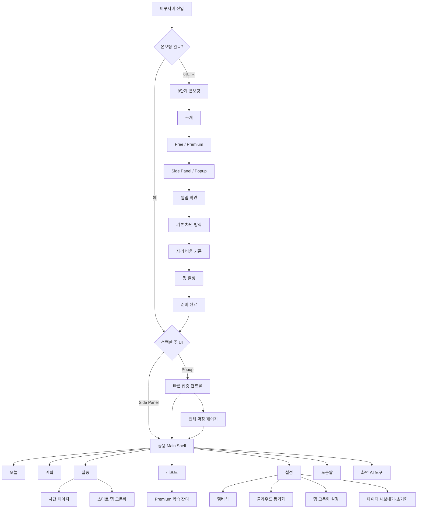
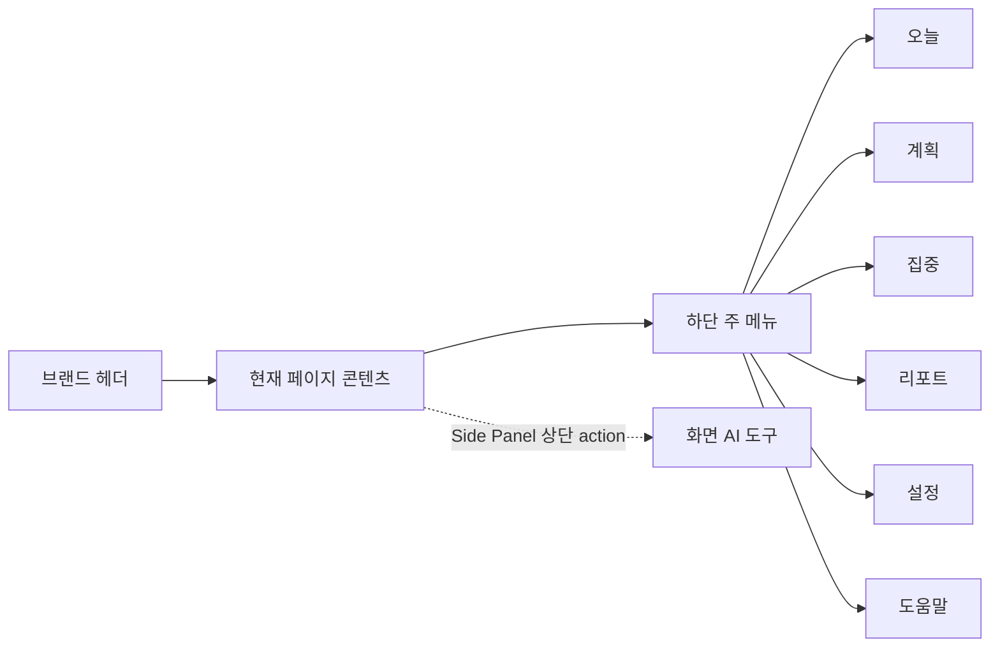
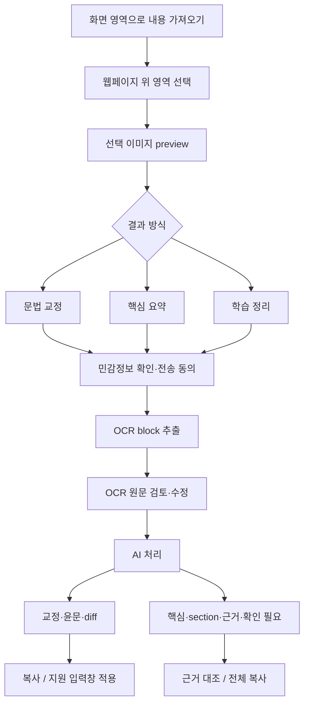
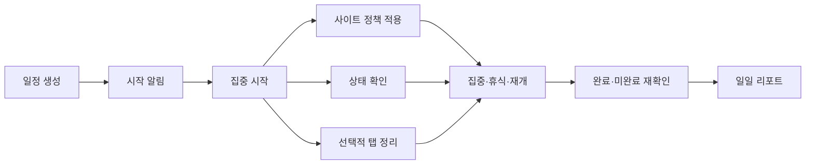
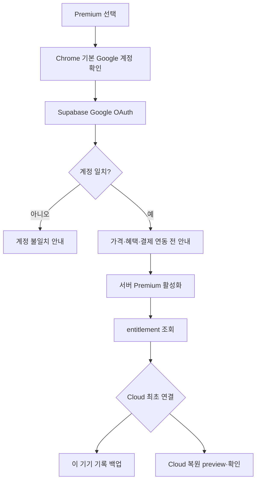
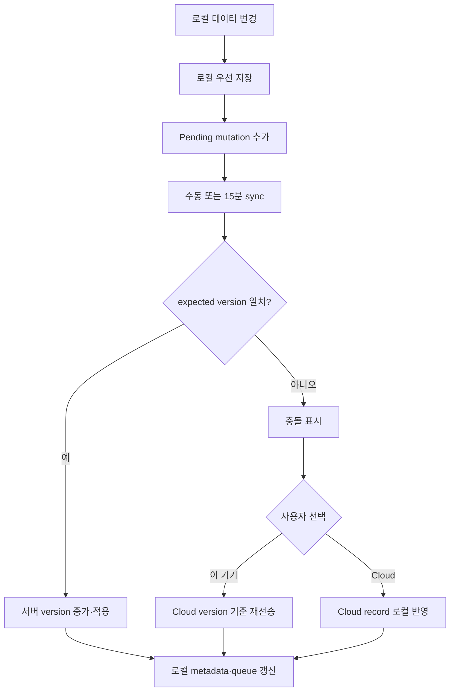
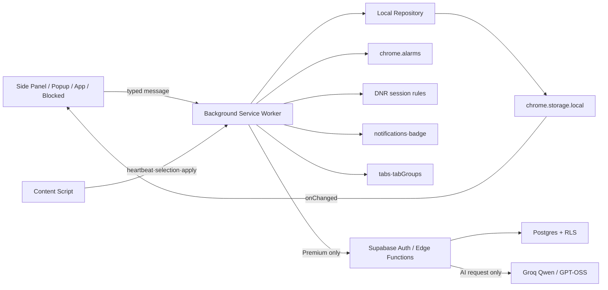
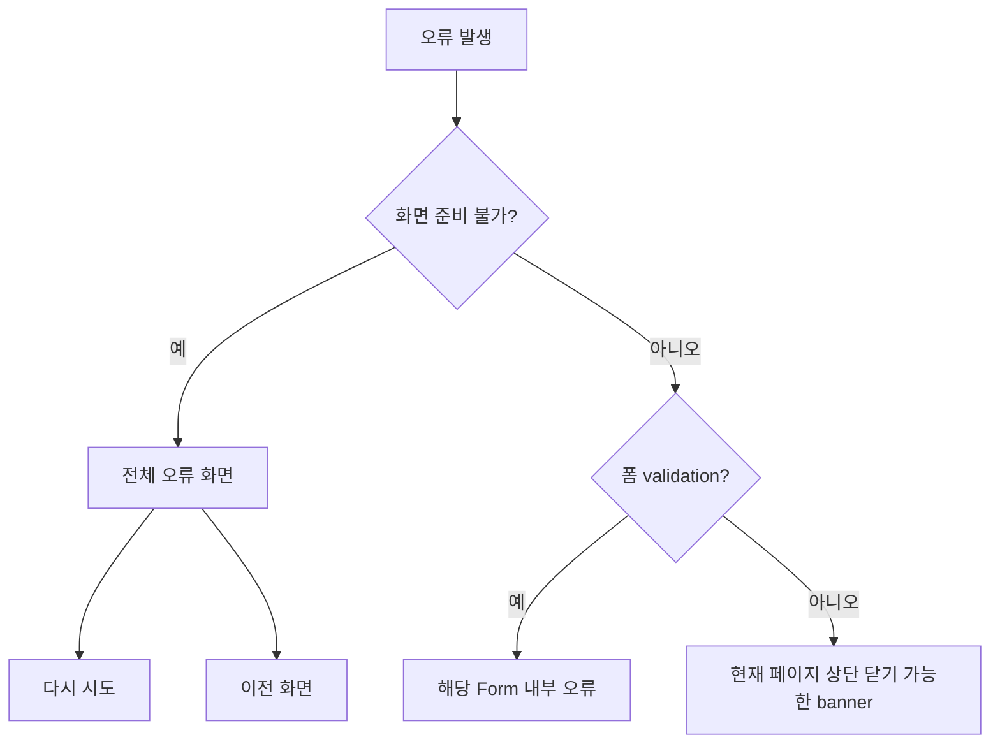

# 미루지마 정보 구조도

> 문서 기준일: 2026-07-16  
> 대상 surface: Onboarding, Side Panel, Popup, 전체 확장 페이지, 차단 페이지, Content Script, 시스템 알림

## 1. 전체 정보 구조



## 2. Surface 역할

| Surface | 목적 | 정보 밀도 | 주요 제약 |
|---|---|---|---|
| Onboarding | 첫 설정과 첫 일정까지 안내 | 낮음, 단계형 | 건너뛰기 가능, Premium 선택 전 외부 요청 금지 |
| Side Panel | 항상 열어두는 기본 전체 기능 UI | 중간 | 좁은 폭 1열, 하단 6개 nav |
| Popup | 현재 행동을 빠르게 제어 | 낮음 | 약 380px, 복잡한 편집·리포트 제외 |
| 전체 확장 페이지 | 넓은 화면에서 전체 기능 사용 | 높음 | 700px 이상에서만 다열 layout |
| 차단 페이지 | 차단 이유와 안전한 복귀·임시 허용 | 낮음 | 본래 사이트 대신 표시, 사유 필수 |
| Content Script | heartbeat, visibility, 화면 선택·적용 | 사용자 UI 최소 | 판단·영속화·alarm 금지 |
| 시스템 알림 | 앱이 닫혀 있어도 시점·상태 전달 | 매우 낮음 | OS 설정 영향, 최대 2개 우선 동작 |
| Chrome badge | 미처리 상태를 축약 표시 | 매우 낮음 | 상세 내용은 앱 내부에서 확인 |

## 3. 공용 Main Shell

Side Panel과 전체 확장 페이지는 같은 feature와 상태를 사용한다.



주 메뉴는 기존 6개를 유지한다. Premium 학습 잔디는 Reports 안에, 멤버십과 cloud는 Settings 안에, 화면 AI 도구는 Side Panel의 별도 action으로 배치한다.

## 4. 화면별 구조

### 4.1 오늘

```text
오늘
├─ 페이지 제목과 설명
├─ 확인할 알림
│  ├─ 제목·본문·발생 시각
│  └─ 집중/일정 이동 · 결과 선택 · 확인 처리
├─ 현재 일정 또는 다음 일정
│  ├─ 시간·집중·권장 휴식·차단 방식
│  └─ 집중 화면 · 지금 시작 · 5분 미루기
├─ 오늘 달성률
├─ Premium 연속 학습 카드
└─ 오늘 일정 전체 목록
```

우선순위는 `놓친 중요 상태 → 지금 해야 할 일정 → 오늘 진행 상황`이다.

### 4.2 계획

```text
계획
├─ 일정 추가
├─ 일정 생성/수정 Form
│  ├─ 일정명·설명
│  ├─ 날짜·시작·자동 종료
│  ├─ 목표 집중·권장 휴식
│  ├─ 활동 유형
│  ├─ 차단 모드
│  ├─ 모드별 도메인 입력
│  ├─ 사이트 preset
│  └─ 검증 오류·저장·목록 복귀
└─ 일정 목록
   └─ 일정 header · 설명 · meta · 도메인 · 수정/삭제/집중 시작
```

차단 모드별 노출:

- Allowlist: 허용 사이트 입력과 허용 preset만 노출
- Blocklist: 방해 사이트 입력과 방해 preset만 노출
- Off: 두 입력 영역을 숨기되 기존 값은 보존

### 4.3 집중

```text
집중
├─ 현재 일정과 세션 상태
├─ 집중 또는 휴식 타이머
│  ├─ 진행·잔여·목표
│  └─ 휴식 회차·누적·권장·초과
├─ 목표 진행률
├─ 현재 허용/차단 사이트 정책
├─ 세션 동작
│  ├─ 일시정지
│  ├─ 휴식 시작
│  ├─ 재개
│  └─ 완료·미완료 + 재확인
├─ 집중 신호
│  ├─ 차단 시도
│  └─ 상태 확인 횟수
├─ 스마트 탭 그룹화
│  ├─ 지금 정리
│  ├─ 정리 전 상태 복원
│  ├─ 현재 작업 세트 저장
│  └─ 분류 필요 탭 교정
└─ 차단·개인정보 안내
```

목표 시간이 끝나면 일반 세션 동작을 숨기고 완료·미완료 결과 선택을 최상위에 둔다.

### 4.4 리포트

```text
리포트
├─ 오늘 기록 집계
├─ Premium 월간 학습 잔디
│  ├─ 이전/다음 달
│  ├─ 오늘로 이동
│  ├─ 날짜별 0~4 강도
│  └─ 날짜 상세
└─ 일일 리포트 목록
   ├─ 날짜·완료 수
   ├─ 실제/목표 집중
   ├─ 휴식·차단·미룸·유휴
   ├─ 일정 달성률·집중 달성률
   ├─ 규칙 기반 요약
   └─ 가장 집중한 일정
```

### 4.5 설정

```text
설정
├─ 멤버십
│  ├─ Free / Premium 상태
│  ├─ Chrome 기본 계정 확인
│  ├─ Google 로그인
│  ├─ Premium 활성화·복구
│  └─ 로그아웃
├─ 클라우드 동기화 (Premium)
│  ├─ 최초 백업 / 복원 preview
│  ├─ 지금 동기화
│  ├─ 백업에서 복원
│  ├─ pending 상태
│  └─ 충돌별 이 기기 / cloud 선택
├─ 기본 집중 설정
│  ├─ 주 UI
│  ├─ 기본 차단 모드
│  └─ 자리 비움 기준
├─ 알림과 활동
│  ├─ 시스템 알림
│  ├─ 집중 상태 확인
│  ├─ heartbeat
│  ├─ 자동 리포트
│  └─ 알림 테스트
├─ 스마트 탭 그룹화
│  ├─ 기능 사용
│  ├─ 시작·재개·새 탭 정책
│  ├─ 기존 그룹·고정 탭 정책
│  ├─ 교정 기억
│  └─ 종료 시 복원 정책
├─ 저장 데이터
│  ├─ JSON 내보내기
│  └─ 전체 기록 초기화 + 확인
└─ 온보딩 다시 보기
```

### 4.6 도움말

```text
도움말
├─ 미루지마가 하는 일
├─ 일정 만들기
├─ Allowlist / Blocklist / Off
├─ 집중·휴식·종료
├─ 차단 페이지와 임시 허용
├─ 자리 비움·알림 문제 해결
├─ Side Panel / Popup
├─ 리포트·데이터 내보내기·삭제
├─ 개인정보
├─ Chrome에 로드하기
└─ Chrome 플랫폼 제약
```

### 4.7 화면 AI 도구



화면 단계:

1. 기능 소개와 영역 선택
2. 전송 이미지·작업 방식·동의
3. OCR block 원문 검토
4. 결과
   - 교정: 최소 교정/윤문, diff, 변경점, 복사, 적용
   - 요약·학습: 정확성 안내, 핵심 항목, section, 근거 ID, 확인 필요, 원문

### 4.8 Popup

```text
Popup
├─ 브랜드와 빠른 집중 컨트롤
├─ 현재 세션
│  ├─ 집중/휴식/결과 대기 상태
│  ├─ 타이머·집중·휴식·차단 meta
│  └─ 일시정지·휴식·재개·탭 정리·종료
├─ 현재 세션이 없으면 다음 일정
│  └─ 시작 · 5분 미루기
├─ 오늘 달성률
└─ Side Panel 열기 · 전체 화면
```

Popup의 `Side Panel 열기`는 사용자 click handler에서 직접 `chrome.sidePanel.open()`을 호출한다. 실패 시 전체 화면으로 조용히 대체하지 않고 Popup 오류를 표시한다.

### 4.9 차단 페이지

```text
접근이 차단됐어요
├─ 브랜드와 집중 보호 상태
├─ 차단 hostname과 이유
├─ 현재 일정과 남은 시간
├─ 집중 화면으로 돌아가기
├─ 이번 일정 허용 사이트
└─ 긴급 임시 허용
   ├─ 1분 / 5분 / 이번 세션
   ├─ 사유 입력
   └─ 사유 기록 후 허용
```

## 5. 주요 사용자 흐름

### 5.1 Free 핵심 흐름



### 5.2 Premium 시작 흐름



### 5.3 Cloud 동기화 흐름



## 6. 시스템 정보 흐름



책임 경계:

| 계층 | 책임 | 금지 |
|---|---|---|
| UI | 표시, 입력, 확인, 메시지 요청 | Chrome Storage 직접 변경 |
| Content Script | 최소 활동 시각, visibility, 선택 overlay, 명시적 text 적용 | 상태 최종 판단, 리포트, alarm |
| Background | 검증, 상태 머신, 저장, alarm, DNR, 알림, 탭, sync orchestration | 영속 상태를 메모리에만 유지 |
| Local Repository | schema migration, snapshot, event prune, cloud queue 연결 | UI 정책 결정 |
| Supabase | 인증, entitlement, versioned sync, RLS, AI proxy·rate limit | Free 집중 흐름 의존성 생성 |
| Groq | 사용자가 동의한 OCR·교정·요약 처리 | API key 클라이언트 노출 |

## 7. 상태별 정보 우선순위

| 상태 | 최우선 정보 | 우선 동작 |
|---|---|---|
| 일정 없음 | 빈 상태와 일정 생성 안내 | 첫 일정 만들기 |
| 일정 예정 | 다음 일정, 시작 시각, 집중·휴식 | 지금 시작, 5분 미루기 |
| 집중 중 | 일정명, 남은·진행 시간, 차단 정책 | 일시정지, 휴식, 종료 |
| 휴식 중 | 이번·누적 휴식, 권장 잔여·초과 | 집중 재개, 종료 |
| 결과 대기 | 목표 종료, 기록될 시간 | 완료, 미완료 |
| 방해 감지 | 감지 기준과 복귀 이유 | 집중 화면 이동, 확인 |
| 자리 비움 | 유휴 기준과 타이머 영향 | 계속, 휴식, 일시정지 |
| 차단됨 | hostname, 이유, 남은 시간 | 돌아가기, 임시 허용 |
| Cloud offline | 로컬 저장 성공, pending 수 | 나중에 sync |
| Cloud conflict | entity와 두 선택지 | 이 기기 또는 cloud 선택 |
| AI 처리 전 | 전송 대상과 개인정보 | 동의, 취소 |
| AI 결과 | 결과와 원문 근거, 정확성 경고 | 대조, 복사·적용 |

## 8. 오류 정보 구조



- 일정 겹침, 과거 시간, 잘못된 도메인은 Form 안에 표시한다.
- 진행 중 세션 중복 시작, 탭 정리 실패, cloud 실패 등은 action banner로 표시한다.
- storage/bootstrap/runtime 연결 실패만 전체 오류 화면을 사용한다.
- 시스템 알림 실패는 badge와 앱 내부 알림을 유지한다.

## 9. 반응형 정보 구조

| 구간 | 구조 |
|---|---|
| Popup 약 380px | 고정 surface 폭, 세로 stack, Popup 전용 하단 action |
| 좁은 Side Panel | 모든 폼·카드 1열, nav 3×2, metric 2열 |
| 일반 Side Panel | 세로 1열 중심, 핵심 action 우선 |
| 전체 페이지 700px 이상 | 일정 Form 2열, Focus 정보 2열, report metric 최대 4열 |
| 차단 페이지 520px 이하 | hostname, 입력, 버튼을 세로 배치 |

모든 화면에서 긴 일정명·hostname 줄바꿈, `min-width: 0`, 카드 내부 overflow 방지, 하단 nav safe area를 유지한다.

## 10. 용어 체계

| 내부 값 | 사용자 표시 |
|---|---|
| `allowlist` | 허용 사이트만 |
| `blocklist` | 방해 사이트만 차단 |
| `off` | 차단 끄기 |
| `interactive` | 입력·클릭 중심 |
| `reading` | 읽기 |
| `watching` | 영상 시청 |
| `offline` | 브라우저 밖 작업 |
| `awaiting-result` | 결과 선택 대기 |
| `work` | 현재 작업 |
| `reference` | 참고 자료 |
| `communication` | 커뮤니케이션 |
| `break` | 휴식 탭 |
| `unclassified` | 분류 필요 |
| `local` conflict choice | 이 기기 버전 |
| `cloud` conflict choice | 클라우드 버전 |

