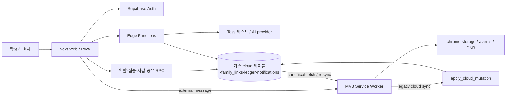
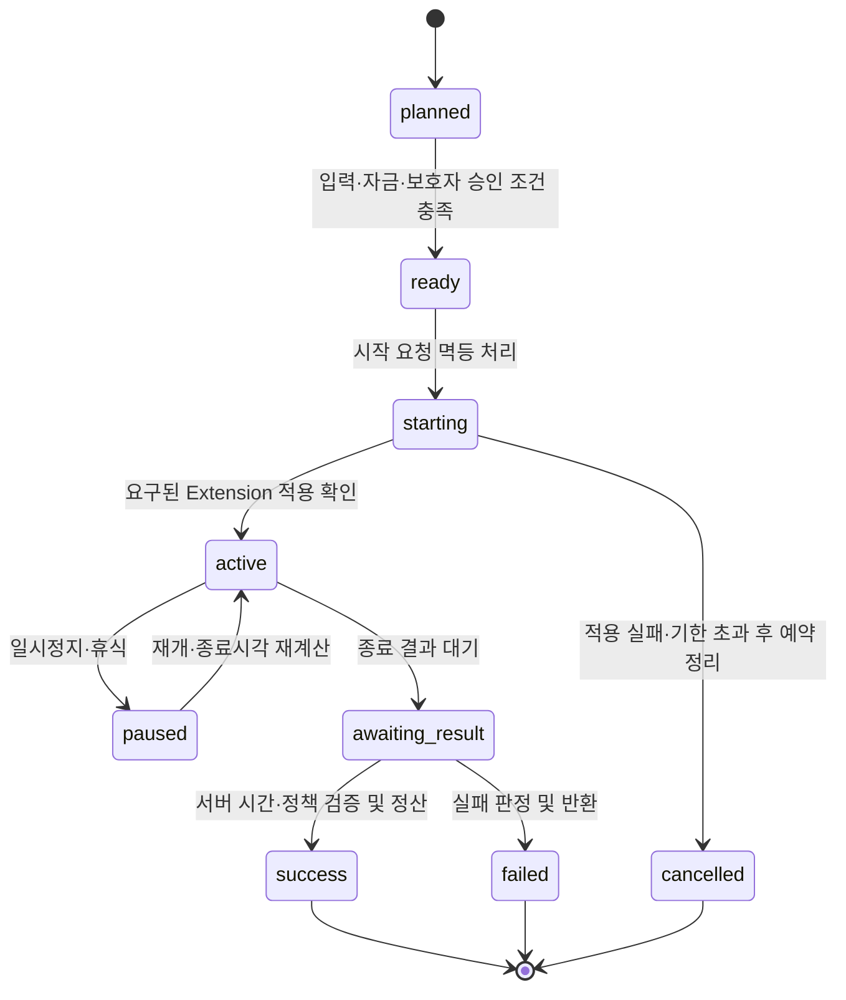

# Mirujima 현재 구조와 개선 경계

## 현재 구조

확인된 주요 경계는 Web `apps/web`, Extension `src`, 공유 계약 `packages/contracts`, 서버 `supabase`다. Extension을 root에 유지하는 것은 현재 명세가 허용하므로 구조 이동 자체를 출시 과제로 삼지 않는다.

## 보존할 부분

1. 실제 차단은 MV3 DNR, 타이머 복구는 지속 저장·alarm, canonical 금융/권한은 서버로 유지한다.
2. Web direct message는 식별자 전달, Extension은 자신의 인증으로 owner와 canonical session을 다시 확인한다.
3. local 집중·탭 관리·OCR·요약 등 기존 기능을 서버 장애나 재구조화 때문에 제거하지 않는다.
4. `Schedule`, `FocusSession` 등 기존 타입은 additive 변경과 migration으로 확장한다.
5. wallet balance는 posted ledger 합산으로 계산한다. UI 성공 표시가 ledger 확정을 대신하지 않는다.
6. AI는 서버 membership/entitlement/rate limit/validation 뒤 실행하며 보호자에게 동의된 집계만 제공한다.

## 우선 변경할 경계

- **동기화 권한:** legacy 데이터의 sync와 서버가 확정한 세션·금융 필드를 분리한다. 클라이언트 전용 플래그로 동기화를 생략하는 것은 RPC 접근 제어가 아니다. canonical row 갱신뿐 아니라 위조 canonical row 신규 삽입·삭제도 검사한다.
- **시작 프로토콜:** 차단이 필요한 세션은 starting과 active를 구분한다. session/request별 적용 응답, timeout, 상태 재조회, 예약 반환을 정의한다. 인증된 Extension의 응답도 변조 불가능한 집중 증거는 아니므로 anti-cheat 보장 범위를 과장하지 않는다.
- **사용자 설정:** 공유 권한은 profile 서버 필드가 기준이다. 읽기·저장·철회·보호자 재조회까지 하나의 흐름으로 검증한다.
- **가족 해제:** 관계만 지우지 말고 active session/reserve/pending reward를 확인하는 transaction을 둔다. 실패하면 관계와 잔액을 유지한다.
- **조회 실패:** 0P/0건/미연결과 조회 오류를 구분한다. stale 표시와 재시도를 제공한다.
- **provider 결과:** 환불을 sandbox 완료로 처리하는 현재 동작은 실제 결제 취소로 이름 붙이지 않는다. provider 결과 확정과 ledger 반영, 장애 후 대조를 분리한다.

## 출시 목표 상태

이 상태도는 **목표 설계**다. 현재 코드에서 모든 전이가 구현됐다는 뜻이 아니다. 차단 off 세션의 시작 확인 조건은 별도 정책으로 정의한다. 네트워크 단절만으로 즉시 실패시키지 않고 로컬 결과를 멱등 재전송한다.

## 변경 범위 제한

새 DB 테이블 없이 기존 payload/column/RPC/index 확장을 먼저 검토한다. 금융 원장과 관계의 의미를 억지로 JSON에 넣어 무결성을 낮추지는 않는다. 신규 테이블이 필요하면 기존 테이블로 표현할 수 없는 이유부터 문서화한다.

큰 focus-planner/globals.css를 전면 재작성하지 않는다. 실제 수정 대상 책임만 분리하고 화면·API 호환성을 검증한다. 새 상태 관리·차트·UI 패키지는 설치 자체가 목표가 아니다.
